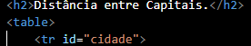
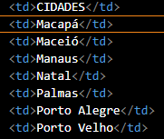
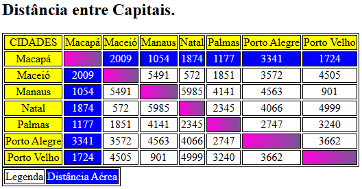

# Projeto- Tabela de Distâncias Entre Capitais Brasileiras

Projeto criado como parte avaliativa da disciplina de Fundamentos de Desenvolvimento Web, ministrada pelo professor Leonardo Rocha.

## Índice

* [Descrição](#descrição)
* [Tecnologias](#tecnologias)
* [Referências](#referência)
* [Autor(a)](#autora)

### Descrição 

O projeto consiste na composição de uma tabela que conta com capitais brasileiras e a distância entre essas capitais. As capitais constantes nesse projeto são:

* Macapá
* Maceió
* Manaus
* Natal
* Palmas
* Porto Alegre
* Porto Velho

### Resultado do Projeto

#### Tabela

* Table - O table consiste o início da tabela.
* Tr - O tr forma as linhas da tabela.

Veja uma imagem de parte do código, onde é possivel identificar o uso dos elementos mencionados acima:

* Td - O td adiciona o conteúdo dentro das células da tabela.

### Resultado da Tabela - Completo

## Tecnologias

* HTML5 
* CSS3
* README
* Git
* Github

## Referência

[Alura](https://www.alura.com.br/artigos/escrever-bom-readme) - Como escrever um README incrível no seu Github.

## Autor(a)

O projeto foi desenvolvido pelo grupo:

* Ana Julia Oliveira Viana
* Isabelly dos Reis Santos
* Larissa Aparecida Iuski
* Maria Luíza Farias da Silva
* Mariane Lima Remonte Viana
* Vitor Gabriel de Souza
* Vivian Oliveira Almeida